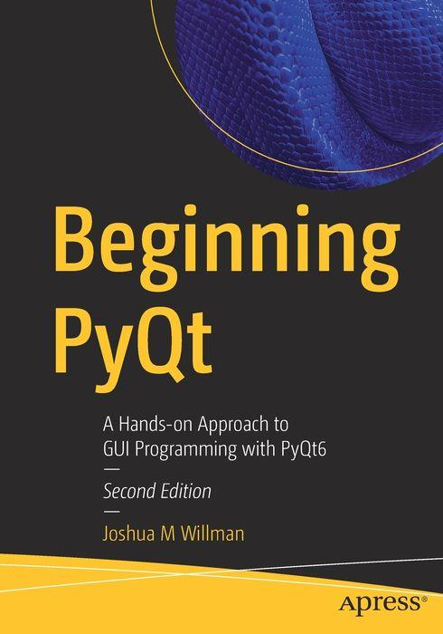

# Beginning-PyQt--second-edition
This repository accompanies [*Beginning PyQt-Second Edition*](https://link.springer.com/book/10.1007/978-1-4842-7999-1#toc) by Joshua Willman (Apress, 2022). 

[comment]: #Beginning_PyQt-Second_Edition_cover

Download the files as a zip using the green button, or clone the repository to your machine using Git.

## Contact the Author 
If there are any questions, comments, or errors found within the next, please contact the author, Joshua Willman, at [redhuli.comments@gmail.com](mailto:redhuli.comments@gmail.com).

## Releases

Release v1.0 corresponds to the code in the published book, without corrections or updates.

## Contributions

See the file Contributing.md for more information on how you can contribute to this repository.
